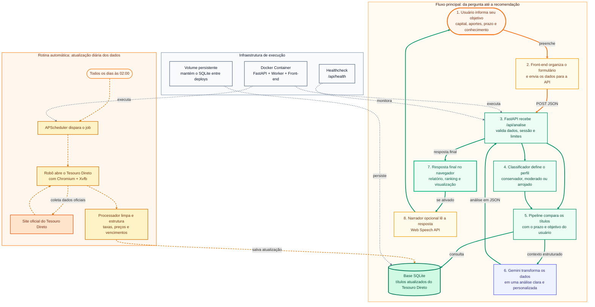

# Rende IA

**Rende IA** é uma aplicação web de recomendação de investimentos em Tesouro Direto que combina análise quantitativa, classificação de perfil de investidor e geração de relatório personalizado com IA.

O sistema guia o usuário por um formulário simples, consulta uma base atualizada de títulos públicos, calcula uma recomendação alinhada ao perfil e ao prazo informado, e entrega uma análise financeira estruturada com apoio da API do Google Gemini.

**Acesse a plataforma:** [https://rende-ia.com.br](https://rende-ia.com.br)

> Projeto voltado para estudo, simulação e demonstração técnica de integração entre dados financeiros, automação web, APIs de IA e deploy conteinerizado.

---

## Estrutura do Projeto

```text
IA_INVESTE/
├── app.py                  # API FastAPI, rotas, scheduler e frontend estático
├── assistente_ia.py         # Integração com Gemini e montagem do relatório
├── banco_dados.py           # Criação e atualização do SQLite
├── processador.py           # Normalização dos dados coletados
├── minha_api.py             # Robô de coleta no site do Tesouro Direto
├── pipeline_quantitativo.py # Análise quantitativa e seleção de oportunidades
├── classificador_perfil.py  # Classificação de perfil com scikit-learn
├── usage_limits.py          # Controle de limite por sessão
├── client/
│   ├── principal.html       # Interface principal
│   ├── styles.css           # Estilos da aplicação
│   └── script.js            # Formulário, chamada API, TTS e interações
├── Dockerfile
├── docker-compose.yml
├── requirements.txt
└── tests/                   # Testes automatizados e E2E
```

---

## Principais Funcionalidades

- **Recomendação personalizada de Tesouro Direto**
  - Classificação do perfil do investidor com base em valor inicial, aportes, objetivo, horizonte de investimento e nível de conhecimento.
  - Análise de títulos disponíveis considerando rentabilidade, vencimento, indexador e aderência ao prazo informado.

- **Integração com Google Gemini**
  - Geração de análise financeira em linguagem natural.
  - Relatório estruturado com seções como cenário macroeconômico, estratégia recomendada, riscos, ranking de oportunidades e glossário.
  - Modos configuráveis para desenvolvimento, fallback e uso real da IA.

- **Atualização automática dos dados do Tesouro Direto**
  - Robô de coleta que acessa o site do Tesouro Direto e extrai as taxas vigentes.
  - Processamento e normalização dos dados antes de gravar no SQLite.
  - Agendamento diário automático com APScheduler, configurado por padrão para rodar às 02:00.
  - Bootstrap automático: se o banco estiver vazio em um novo deploy, o sistema dispara uma atualização inicial em background.

- **Experiência acessível com narração por voz**
  - Sistema de Text-to-Speech nativo usando Web Speech API.
  - Narração da introdução, etapas do formulário, página Sobre e resposta da IA.
  - Limpeza de Markdown, emojis e símbolos antes da fala.
  - Fatiamento de textos longos para reduzir interrupções do navegador durante a narração.

- **Deploy conteinerizado**
  - Backend, frontend, scraper, navegador automatizado e scheduler empacotados em Docker.
  - Docker Compose com volume persistente para o SQLite.
  - Healthcheck HTTP para monitorar o container.

---

## Tecnologias Utilizadas

### Back-end

- Python 3.11
- FastAPI
- Uvicorn
- Pydantic
- SQLite
- APScheduler
- python-dotenv

### Dados e Machine Learning

- pandas
- NumPy
- scikit-learn
- RandomForestClassifier
- Pipeline e StandardScaler

### Inteligência Artificial

- Google Gemini API
- SDK `google-genai`
- Modelo padrão configurado: `gemini-3.1-flash-lite`
- Estratégias de fallback para desenvolvimento e resiliência

### Front-end

- HTML5
- CSS3
- JavaScript
- Web Speech API (`window.speechSynthesis`)
- Marked.js para renderização de Markdown
- Chart.js e chartjs-plugin-annotation para visualização no navegador
- Google Fonts

### Web Scraping e Automação

- Selenium
- undetected-chromedriver
- webdriver-manager
- Chromium
- ChromeDriver
- Xvfb para execução de navegador em ambiente sem interface gráfica

### Infraestrutura

- Docker
- Docker Compose
- Volume persistente para SQLite
- Healthcheck no container
- Variáveis de ambiente via `.env`

---

## Arquitetura de Software

A aplicação segue uma arquitetura simples em camadas:

1. O **front-end** coleta os dados do usuário e envia para o endpoint `/api/analise`.
2. O **FastAPI** valida o payload, classifica o perfil e aciona o pipeline quantitativo.
3. O **pipeline** lê os títulos do SQLite, calcula métricas e seleciona oportunidades compatíveis com o perfil.
4. O **Gemini** recebe os dados já estruturados e gera a análise final personalizada.
5. O **front-end** renderiza o relatório e, se o narrador estiver ativo, lê a resposta em voz alta.
6. Em paralelo, o **scheduler** executa diariamente o robô de atualização do banco.




---

## Pré-requisitos

Para rodar com Docker, você precisa ter instalado:

- Docker
- Docker Compose
- Uma chave de API do Google Gemini

Opcional para desenvolvimento local sem Docker:

- Python 3.11+
- Ambiente virtual Python
- Chromium ou Google Chrome instalado

---

## Configuração de Variáveis de Ambiente

Crie um arquivo `.env` na raiz do projeto. Exemplo:

```env
# Google Gemini
GEMINI_API_KEY=sua_chave_do_gemini_aqui
GEMINI_MODEL=gemini-3.1-flash-lite

# Modos aceitos: real, fallback, mock
RENDE_IA_GEMINI_MODE=real

# Se true, falhas da IA real retornam erro ao usuário em vez de fallback determinístico
RENDE_IA_REQUIRE_GEMINI=false

# Limite por sessão quando a IA obrigatória estiver ativa
RENDE_IA_REQUIRE_GEMINI_MAX_REAL_ATTEMPTS_PER_USER=5
RENDE_IA_REQUIRE_GEMINI_ATTEMPT_WINDOW=86400

# Scheduler do banco
TZ=America/Belem
RENDE_IA_DB_UPDATE_HOUR=2
RENDE_IA_DB_UPDATE_MINUTE=0

# Flags opcionais
RENDE_IA_DISABLE_DB_SCHEDULER=false
RENDE_IA_DISABLE_DB_BOOTSTRAP=false
```

Notas:

- Nunca versione o arquivo `.env` com chaves reais.
- O `.dockerignore` já exclui `.env`, bancos SQLite locais e arquivos de ambiente virtual do build.
- Para desenvolvimento sem consumir cota do Gemini, use `RENDE_IA_GEMINI_MODE=mock` ou `RENDE_IA_GEMINI_MODE=fallback`.

---

## Como Rodar o Projeto

### 1. Clone o repositório

```bash
git clone <url-do-seu-repositorio>
cd IA_INVESTE
```

### 2. Crie o arquivo `.env`

```bash
nano .env
```

Preencha as variáveis conforme o exemplo da seção anterior.

### 3. Suba a aplicação com Docker Compose

```bash
docker compose up -d --build
```

### 4. Verifique se o container está saudável

```bash
docker compose ps
```

O status esperado é semelhante a:

```text
rende-ia   Up ... (healthy)   0.0.0.0:8000->8000/tcp
```

### 5. Acesse a aplicação

Localmente:

```text
http://127.0.0.1:8000/principal.html
```

Documentação automática da API:

```text
http://127.0.0.1:8000/docs
```

Healthcheck:

```text
http://127.0.0.1:8000/api/health
```

### 6. Acompanhe os logs

```bash
docker compose logs -f rende-ia
```

Você deve ver mensagens como:

```text
[Scheduler] Atualização diária do banco configurada | horario=02:00 | timezone=America/Belem
[Scheduler] Banco já possui títulos | titulos=36
```

### 7. Forçar atualização manual do banco, opcional

O job diário roda automaticamente. Se quiser forçar uma atualização pontual:

```bash
docker exec -e DISPLAY=:99 rende-ia python banco_dados.py
```

### 8. Parar a aplicação

```bash
docker compose down
```

Para remover também o volume persistente do SQLite:

```bash
docker compose down -v
```

Use `-v` apenas se quiser apagar os dados persistidos.

---

## Rotinas Automáticas

### Atualização diária dos títulos

O agendador é iniciado junto com o FastAPI e executa a atualização do banco diariamente, por padrão às `02:00`.

Variáveis relacionadas:

```env
RENDE_IA_DB_UPDATE_HOUR=2
RENDE_IA_DB_UPDATE_MINUTE=0
TZ=America/Belem
```

### Bootstrap de banco vazio

Quando o container sobe com um volume novo e o banco ainda não tem dados, o sistema detecta essa condição e agenda uma primeira atualização em background.

Para desativar esse comportamento:

```env
RENDE_IA_DISABLE_DB_BOOTSTRAP=true
```

---

## Testes

Algumas suítes usam modo mock ou fallback para evitar consumo de cota da API Gemini.

Exemplos:

```bash
RENDE_IA_GEMINI_MODE=mock venv/bin/python tests/test_correcoes.py
RENDE_IA_GEMINI_MODE=mock venv/bin/python tests/test_api_cenarios.py
```

Testes E2E com Playwright:

```bash
cd tests/e2e
npm install
npx playwright install chromium
npx playwright test
```

---

## Aviso de Transparência

Esta plataforma é uma ferramenta de estudo e simulação automatizada por Inteligência Artificial. As opções de investimento, taxas e dados utilizados nas análises são extraídos explicitamente dos dados oficiais disponibilizados no site do Tesouro Direto.

As respostas geradas pela IA devem ser interpretadas como apoio educacional e simulação, não como recomendação financeira individualizada, consultoria de investimentos ou garantia de rentabilidade futura. Antes de investir, consulte as informações oficiais do Tesouro Direto e avalie sua situação financeira, seus objetivos e seu perfil de risco.

Para consultar os dados brutos e oficiais, acesse o portal do Tesouro Direto.

---

## Autor

Desenvolvido por **Eduardo Forte**.

LinkedIn: [Eduardo Forte](https://www.linkedin.com/in/eduardo-forte-nascimento/)
